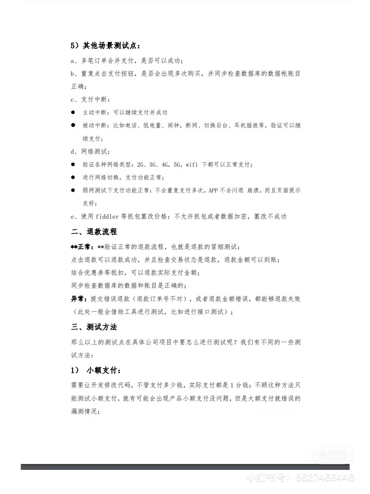

# 测试用例

判断闰年

1.  西元年份除以4可整除，且除以100不可整除，為**閏年**。
2.  西元年份除以400可整除，為**閏年**。

# 测试流程

  需求测试->概要设计测试->详细设计测试->单元测试->集成测试->系统测试->验收测试 

  1、单元测试：完成最小的软件设计单元（模块）的验证工作，白盒

  2、集成测试：增量集成单元测试。【自顶向下、自底向上】，白盒黑盒相结合

   3、系统测试：是基于**系统**整体**需求说明书**的**黑盒类测试**，应覆盖系统所有联合的部件。

   4、回归测试：回归测试是指在发生修改之后重新测试先前的测试用例以保证修改的正确性。

   5、验收测试：根据测试计划和结果对系统进行测试和接收。它让系统用户决定是否接收系统。验收测试包括Alpha测试和Beta测试。 

  Alpha测试：开发的受控环境。 由用户在开发环境下进行的测试

  Beta测试：不受控的实际环境。 

仿真测试：它不是遍历所有功能的测试，也不是系统测试，它是以用户的具体使用为标准的测试。模拟

仿真测试一般发生在产品交付使用前

验收测试是部署软件之前的最后一个测试操作

先仿真再验收~

**非全量测试：（也不是验收测试）**

灰度测试：就是在某项产品或应用正式发布前，选择特定人群试用，逐步扩大其试用者数量，以便及时发现和纠正其中的问题，由“灰”到“黑”。

>   里灰：公司内部
>
>   外灰：对外透出

AB测试一般由产品经理和运营来主导。它是把两种功能，或者两个版本，交给相同的用户来使用，看用户喜欢哪种功能。

6、冒烟测试：只测试重要的功能，或者大概进行个测试

7、接口测试：前后端接口是否符合预期，内部系统以及各个子系统之间的交互点。

# W模型

V模型的缺陷在于仅仅把测试过程作为在需求分析、系统设计及编码之后的一个阶段，忽视了测试对需求分析、系统设计的验证，因此需求阶段的缺陷很可能一直到后期的验收测试才被发现，此时进行弥补将耗费大量人力物力资源。

相对于V模型，W模型增加了软件各开发阶段中应同步进行的验证和确认活动。并行关系

# 白盒和黑盒

黑盒测试也称功能测试或数据驱动测试，在测试时，把程序看作一个不能打开的黑盆子，只检查程序功能是否按照需求规格说明书的规定正常使用。

常用的黑盒测试方法有：等价类划分法；边界值分析法；因果图法；场景法；正交实验设计法；判定表驱动分析法；错误推测法；功能图分析法

白盒测试也称为结构测试或逻辑驱动测试，是针对被测单元内部是如何进行工作的测试，穷举路径的测试方法。白盒测试需要遵循的原则有：1. 保证一个模块中的所有独立路径至少被测试一次；2. 所有逻辑值均需要测试真（true）和假（false）；两种情况；3. 检查程序的内部数据结构，保证其结构的有效性；4. 在上下边界及可操作范围内运行所有循环。

 常用白盒测试方法： 

 静态测试：不用运行程序的测试，包括代码检查、静态结构分析、代码质量度量、文档测试等等，它可以由人工进行，充分发挥人的逻辑思维优势，也可以借助软件工具（Fxcop）自动进行。 

 动态测试：需要执行代码，通过运行程序找到问题，包括功能确认与接口测试、覆盖率分析、性能分析、内存分析等。 

  白盒测试中的逻辑覆盖包括语句覆盖、判定覆盖、条件覆盖、判定/条件覆盖、条件组合覆盖和路径覆盖。六种覆盖标准发现错误的能力呈由弱到强的变化： 

**条件覆盖**

1.**所有条件**可能**至少执行一次**取值；2.所有判断的**可能结果**至少执行一次。

t f

f t

t t

**语句覆盖**(Statement Coverage)的含义是：选择足够多的测试数据，使被测程序中的**每条语句至少执行**

**一次**。

# 手工和自动化

手工测试：代价昂贵，依赖测试人员的能力

自动化测试：回归测试，模拟环境测试，可重复性，增加可信任性，

# 测试的具体工作

  搭建测试环境 

  撰写测试用例 

  执行测试用例 

  写测试计划，测试报告 

  测试，并提交BUG表单 

  跟踪bug修改情况 

  执行自动化测试，编写脚本，执行，分析，报告 

  进行性能测试，压力测试等其他测试，执行，分析，调优，报告 

# 性能测试

内存：空闲、中等、满规格

cpu、流量、电量、启动速度（首次、非首次）、滑动速度

# BUG的周期

new\assigned\open\fixed\pending reset\reset\closed\reopen\rejected\postponed

# 测试类型

测试是软件开发中不可或缺的一环，测试通过经济，高效的方法，捕捉软件中的错误，从而达到保重软件内在质量的目的。 

测试分为功能测试和非功能测试，非功能测试又可以分为性能测试、压力测试、容量测试、健壮性测试、安全性测试、可靠性测试、恢复性测试、备份测试、协议测试、兼容性测试、可用性测试、配置测试、GUI测试。 

功能测试：正常功能

**性能**测试：可接受范围内，是否能达到性能预期。【how much && how fast】

>   rt响应时间

**负载**测试：不断增加并发请求，直到性能指标达到临界值【摸高】

>   目的：不断增加软件的业务压力, 探测软件在保证预定性能指标的情况下所能负担的**最大压力。**
>
>   结果：保证系统安全下的最大压力

**压力**测试：超过安全负载的情况下，对系统继续施加压力（并发，循环操作，多用户，网络流量），直到系统崩溃【持续】

>   目的：在较大业务压力下，测试软件是否有缺陷
>
>   结果：在最大压力（或者持续）下，系统什么时候崩溃

>   负载和压力一样吧：用户数、请求数（qps => tps）
>
>   tps是事务每秒查询率
>
>   qps是每秒查询率（只是说数据库，所以会常用tps）

**容量**测试：我感觉是确定负载测试的预期值，面向数据

>   先做性能测试，测完以后去负载测试摸高（摸高），然后再用压测去看系统的稳定性（持续）
>
>   -   压到10000的时候，发现系统错误量明显升高了，排查后发现是某某接口的实现有问题，可以先标记，搞一个预案，（补救措施！）
>
>   
>
>   风险点是测试过程中任何时刻都会出现的，不以此来区分测试阶段
>
>   确认风险点：业务场景，或者一些阈值
>
>   -   集群中某个集群有问题，可能也不是风险点
>   -   集群中每个集群都有问题，虽然阈值可能都正常，可能是风险点

可用性测试(系统测试)：可用性测试是面向用户的系统测试

配置测试：配置测试将验证软件与其所依赖硬件环境的依赖程度

健壮性测试：容错测试首先要通过各种手段让软件系统强制发生故障，然后验证系统能否快速恢复

安全测试：安全测试检测系统对非法入侵的防范能力

负载测试：能承受的最大压力，比如接口数

压力测试：能在最大压力下承受多久，各项指标是否正常

性能测试：影响因素

# 为什么做测试

我认为测试开发在软件的声明周期中是非常重要的一个持续性的工作，贯穿开发的各个阶段，良好的测试会帮助开发减少大量的人力和物力。测试是在开发之后在测试环境中进行验证，一般分为手工和自动化测试，我选择该岗位的原因在于，我可以在bug或者漏洞的发现过程中获得乐趣，并且在研究生的研究生涯中，我的主攻方向就是漏洞检测，对bug或者漏洞都进行过手动分析，贴近安全测试，更进一步的，利用AI模型、fuzzing测试、符号执行等技术进行自动化测试，最后根据分析结果，写相应的测试报告，在github上报告了多款知名软件的漏洞，发现了不少于10个CVE。

# 分析测试用例的流程

明确系统有哪些功能 =》 功能测试

>   评估方法：混淆矩阵（acc,pre,recall）、auc曲线（tpr/fpr）、

有哪些功能评估的指标，有哪些其他影响因素（网速、内存、cpu、电量） =》性能测试

界面布局、文字等=》UI测试

如果是用户的易用性=》系统测试

安全测试：sql注入、os注入 

兼容性测试

会有哪些意外情况、极端情况 =》健壮性测试

突然黑屏闪退：

弱网的情况下，异步加载时提前调用了数据

对象还没有来得及初始化就使用了

导致了空指针异常

# 利用机器学习的方式进行测试

如何用机器学习去进行自动化测试，就是让自动化测试变得更加智能，在自动化测试过程中，当测试功能模块越来越多，没有太多的时间去全部覆盖，我们可以采用归纳学习的方式，基于自动化测试的执行结果或者手工测试执行的结果为数据输入，然后基于一定的模型（例如：以**通过率和模块的重要率计算的平均值**）得出测试推荐模块，或者当要执行一个功能模块时，基于历史数据和模型（bug出现的错误相关性，功能相关性等）计算出与该功能模块相关性最大模块，并推荐测试。 

**输入分布**

# 常用的自动化测试框架

自动化测试框架：提供了自动化测试用例编写、自动化测试用例执行、自动化测试报告生成等基础功能。

**Junit：**

常用于做单元测试、test case不允许出现任何的依赖关系

常常利用断言的方式，进行判断

可以看到失败、成功用例、代码覆盖率

在测试类方法中，publi c void 无方法参数，以test开头（通过反射找出所有方法）

常用注解：@before（初始化），@test（测试），@after（释放资源）

**模块化测试框架**

此框架允许将被测应用程序划分为单独的模块，单元或部分。每个模块都会**为它们创建独立的测试脚本**。因此，每个模块及其测试脚本的组合可以构建代表各种测试案例的更大的测试。

**数据驱动框架**

数据驱动框架主要是解决测试数据问题。**测试数据和测试脚本是分离的**。具体来说，测试脚本是固定的，而测试数据可以从外部的数据文件，以Excel、CSV、SQL等形式作为参数传入测试脚本。

易于维护。减少硬编码

在 Python 架构里，最出名的数据驱动框架就是 DDT。

**关键字驱动框架**

该框架是**数据驱动框架的扩展**。测试数据和测试脚本也被分离，不同的是，该框架要更进一步地**将测试脚本中的通用功能剥离出来，形成关键词(keyword)。**

当把一系列代码封装为要给关键字，在测试的过程中，通过组合关键字的方式来生成测试用例，而不关心关键字如何运作的，这种为关键字驱动框架。

**混合模型**

并不一定要选择上面的三种框架之一，需要根据需求灵活的选择测试框架，在工作中可能经常需要糅合不同的框架模型，这样的模型就叫做混合模型。

postman 接口测试

jmeter接口测试，性能测试

## 开发不认

>   1，明确需求的分析，是否是和需求文档一致
>
>   2，环境不同：开发人员的环境，说明文档上的环境和测试环境，可能出现了不一致的情况
>
>   3，可能外界因素影响：比如内存、缓存、其他软件、网络等。可以通过日志、对比进行验证，尝试重现
>
>   4，当bug的缺陷等级比较高的时候，一定要和开发积极沟通，进行风险评估报告
>
>   5，如果事态紧急，不可避免的找相关领导、测试同事进行评审解决。小组评议、领导评议，但是可能不利于和开发的关系，基本上不考虑。

# 一些问题

## 性能测试

客户端：测试手机内存占用、耗电量、流量等

和安装软件前对比各项数据参数

和安装其他软件的参数对比

提出建议，进行优化

## 视频黑屏可能的问题

误触

视频本来有问题

设备自身的问题

带宽的问题：响应的时间太慢导致的黑屏

网络变化的原因：不同的网络间的切换可能会影响app稳定性，短时间的黑屏

内存原因：可以使用的内存过低，或者非授权的内存位置的使用

用户过多的原因

代码原因：没有经过测试的新功能，上线到声场环境之后可能会出现黑屏

第三方系统的原因：第三方广告或弹幕可能会导致app黑屏

视频格式不支持

如何定位？

-   记录操作步骤，尝试重现，找出导致黑屏的关键步骤从而得知出错原因，然后查看错误日志，根据错误日志来定位程序出错的代码
-   抓包，看响应的媒体流，查看编码解码信息，确定视频格式是否是我们支持的

## 闪退的原因

**代码：**

内存泄漏：同一个对象不停得开辟，没有释放

内存溢出：程序所消耗的内存大于硬件提供的内存

死循环：没有合理的循环控制流

接口：不是预期值，解析数据失败导致闪退

空指针异常：对象没有初始化就使用

>   弱网情况下，异步加载时提前调用了数据。对象还没来得及初始化就使用了

**客观：**

程序缓存过多

手机过热

手机电量过低

安装位置不对

app和手机系统不兼容

应用版本过低，有些api可能没有

系统升级以后新旧版本不兼容

手机配置原因

下载时确实了某部分的数据包

突然中断导致崩溃，中断测试

弱网，服务器响应不及时

手机内存不足，运行程序过多

设计不合理，一个接口，拉取数据量太大，请求慢且占大量内存，导致app闪退

cpu占用过大

## 没有声音

上传阻塞：源源不断的产生音频数据，上传网速过小，可能会阻塞

下行阻塞：观众的下载带宽或者网络波动

手机发烫，数据量太大，程序进程太多，缓存。

## 视频一直加载中

先排查是客户端还是服务器的问题

客户端：

先看看其他视频是否能打开，看浏览器是否可以访问其他页面

检查客户端网络配置（wifi, 网线）

刷新看看是不是网速不好，或者测下网速，可能异步加载数据造成了空指针

查看dns是否解析正常，可以通过抓包，也可以通过直接ip访问

ping 自己主机，看是否网卡配置有问题，防火墙设置太严格

**带宽和传输速度的不平衡**

是否是网络延迟大

清除缓存

服务器：

抓包看tcp握手是否成功，不成功很可能是网络拥塞

如果成功则看状态码，4xx客户端问题，5xx服务器内部问题

有可能是服务器的资源被移除

查看服务器运行日志，尝试定位问题

## 判断bug是前端还是后端

接口查看法：

1.请求接口的URL是否正确，若错误，为前端bug

2.body的传参是否正确，若错误，为前端bug

3.响应的状态码是否正确，若错误，为后端bug

4.响应的内容是否正确，若错误，为后端bug

5.请求和响应都正确时，前端是否跳转、渲染，若错误，为前端bug

日志查看法：

当我们发现一个bug，并不确定这个bug属于前端还是后端，可以查看后端服务的日志，复现bug时，查看日志中有没有相关信息，基本可以认为，如果日志没有输出，很可能这个功能并没有与后端交互，也就不存在后端的问题。反之，如果日志有输出，可以进一步查看有无错误日志信息，进一步分析。

## 界面卡住

比如游戏结算页面，卡住不动

事务没有结束：

-   弱网

-   同时间结算的人过多

    服务器来不及处理，游戏staus状态没有更新

-   NPE

    异步，导致了一个线程使用了另一个线程没有初始化的变量

    >   学长说这个错，太低级了，一般不会，因为有重试，看看是否可以异步重试了

## 场景

 当多个人同时邀请一个人加入游戏，但是此人没有收到邀请是为什么？商城可以打开，语音里可以说话

学长问我的这个问题，

我说首先排除网络问题，因为可以打开商场...然后学长就说 一进来就掉坑里了

也有可能是网络问题，因为商场的可能是因为命中了缓存

除此以外，因为语音里可以说话，还有可能是相关功能的服务器的请求的连接有问题

并发对事件处理不正确

# 测试案例

梳理产品的核心业务流程

根据流程进行模块的细分，然后针对每个功能模块进行详细的测试点设计和提取

针对具体功能，寻找每个输入项和步骤

## 测支付功能

梳理产品核心流程：点击支付，选择支付方式，确认金额，输入密码，成功支付

冒烟测试

## 电商如何测试

## 购物车

功能测试：按每个功能想每个测试点，不要慌

未登录用户的提示，会进行拦截

以下功能是在登录状态下：

进入购物车：

>   显示店铺名，店铺优惠，商品图片和价格，店铺等级
>
>   **下拉刷新状态**

加入商品到购物车，信息和价格核算正确，选择地址

>   加入：
>
>   单个商品数量：库存，限购，最大值，最小值
>
>   没有货物的时候是否能添加到购物车
>
>   单个店铺可以添加的商品数量
>
>   整个购物车可以添加的数量
>
>   
>
>   价格：
>
>   针对不同的用户（学生，会员）价格是不一样
>
>   可能会有店铺活动，同时要注意什么时候过期，注意过期后价格是否会变化
>
>   店铺满减，跨店满减，哪些店铺可以参与，也要注意过期，过期后是否购物车价格会变化
>
>   
>
>   **选择地址：**
>
>   是否可以切换、更新地址、新增、保存、默认
>
>   选择不同的地址，运费会有不同的变化
>
>   
>
>   结算：
>
>   一个商铺结算一个，结算多个，多个商铺结算，运费问题
>
>   单选、多选、取消

删除商品

修改商品属性，数量等

点击商品链接是否可以跳转，还有商铺链接

商品链接是否可以点击

空白购物车页面检查

购物车的商品最长时间，过期会自动删除，或者提示

失效商品的提示，且不可结算

点相似商品，要统计结果是否和算法一致

商品、店铺是否可以分享

可能会拉黑商家

**在小程序里加入的商品，在app中是否有刷新，看是否加入成功**

UI测试：

名字太长是否显示全

图片是否可以正常显示

风格是否统一

是否有错别字

和不同的比例的屏幕是否显示比例都正常

红点是否变化，点击后颜色是否会变化

输入框、长度、按钮、高度

兼容性测试：

不同系统，不同系统版本、不同软件版本

机型、屏幕、分辨率

性能测试：

内存、cpu、缓存、网速、电量、并发

评价指标：时间

健壮性测试：

中断测试：插拔耳机、蓝牙、电话、短信、主观切除、后台删除

系统测试：

编辑页面（地址），是否支持复制粘贴，智能填充

中断后是否还需要重新输入，不小心点到界面外

说明文档、操作提示、针对不同用户、相关提示信息

接口测试：

返回数据是否正确

安全测试：

**不同的设备上的登录**

登录次数的限制

权限设置

## 发红包

发红包

> 基本框架：业务功能（前端和后端）和高可用（性能、稳定性、容量：限流、压测、应急）

场景：

发送的对象：

个体：输入金额、备注、选红包封面、支付密码、发送红包

群发：选择红包种类、输入金额、备注、选红包封面、支付密码、发送红包

**功能测试**：

登录状态，否则拦截

有效输入：对输入的金额上限，下限，余额限制，

无效输入；空值、负数、非数字

**输入金额的增删改查**

备注：表情（动、静、录制）、文字（数字、中文、英文、其他语言）、格式、边界、空格、增删改查

取消发送红包

红包封面：拥有、未拥有、拥有过

支付方式：指纹、免密、人脸、数字

支付来源：余额、银行卡、组合

红包种类：红包金额是否随机

未领取的红包在24小时内退回

发送后 金额的核实

加起来是否是总金额

人数、

红包只抢了部分

**一个人反复点红包**

手气最佳

**每个红包的最小金额**，**是否会验证**，分到钱小于0.01

红包过期，**是否还能查看金额**

红包记录

能给一个人发多少红包

领红包的时效性

余额不足、支付的优先级

是否可以连续多次发红包；

pc端能否发

发送失败，相应金额有变化吗

**安全**：

是否会有注入的风险

密码

**性能测试**：响应时间、耗电量、消耗流量、内存、qps（每秒查询率：流量）、缓存命中率

网络测试

高可用：

> 因为redis的读写效率高、成本高，所以会用在对性能更高的场合，比如秒杀、抢购、实时排行榜等。而mysql可以存储大量的数据，持久化到硬盘，性价比高，在性能要求不是那么高的场合都建议采用mysql

压力测试：强度测试，长时间的运行测试软件，来测试被测系统的性能、可靠性、稳定性。

是否有相应的应急方案？

负载测试：找到最大任务数。并发用户或者http连接的数量。

性能测试：排除系统的性能瓶颈，而不是去找bug。网络性能。

1.高并发下，有无限流？是否并发安全？（一起发红包、一起抢红包）

为了满足大并发的情况下，是会有集群部署的：

2.集群的可用性测试：

- 一主多从，当一个主机坏掉了，会不会自动切换一个从库，主库修好了，是否会还原成主库

- 压力测试：测序高并发的情况去模拟故障

- 硬件的可用性：在真实业务情况下，硬件是否会出问题，以及硬件的真实吞吐量，测试每个节点的流量是否均衡
- 缓存一致性？

高可用：

- 将一个系统拆分成多个子系统，每个系统连一个数据库，提高并发

- 缓存：读多写少，读写分离

- mq：写多读少，利用mysql+mq

    > redis不适合写多的场景

- 分库分表

分布式锁：对于一个key，只有一个可以锁，其他都等，也就是一个key上的去串行处理

优化：concurrenthashmap=》分段锁

ui测试：

接口测试：

兼容性测试：不同地区

系统测试：是否支持复制粘贴、限制和提示；帮助链接、

健壮性测试：

## 项目本身如何测试

混淆矩阵，ioc，auc(fpr,tpr)

准确率（Accuracy）：预测正确的样本数量与总样本数量之比
【预测正样本=》误报率】精确率（Precision）:查准率，在预测为正样本的样本中实际为正样本的概率。高精度表示低假阳率（低误报率）。
【实际正样本=》漏报率】召回率（Recall）:查全率，在实际为正样本的样本中被预测为正样本的数量与正样本数量之比。高召回率表示低假阴性率(低漏报率）。**TPR**

F1值（H-mean值）:精确率和召回率的调和平均数。

p和r不能兼顾，可以从机器学习的角度进行解释

【实际负样本=》FPR】

tpr=recall

fpr=fp/(fp+tn)

## 算法测开

[参考](https://www.bilibili.com/read/cv17822753)

-   调优
-   场景
-   迭代方向
-   特征：规则化，度量
-   问题：特征，数据，模型

算法稳定：长时间运行，数据量增加

性能：响应时间，cpu磁盘消耗

兼容性：不同值的数据，算法是否稳定（用户年龄，区域，性别等不同数据集）

算法pk：不同场景下

A/B测试：向上5%-10%，形成对照组来进行测试

## 协议测试

假设http转成https需要如何测试

http和https都是超文本传输协议

在端口正常条件下数据能否正常传输主要看http的返回值

>   端口改变，80-》443，需要把之前接口测试脚本修改

加密协议是否在需求规定范围内

>   比如a端使用md5加密，那么与之对应的md5解密是否正常

抓包，看加密后的https协议的数据是否经过加密无法解析

安全测试：是否对sql注入，url发起地址攻击是否有专栏

**从每一层进行测试，如果不正确则从每一层协议的通信过程进行测试**

物理层：2g,3g，wifi功能是否正常

数据链路层：是否丢包，网卡，交换机是否有问题，ping一下自己主机

网络层：防火墙、路径路径

应用层：dns（先利用ip进行访问），是否是网络设置问题，浏览器设置问题

是否建立了tcp连接，

...

tcp：

可靠性（分割、序列号、流量控制、拥塞控制、快重传、快恢复、ARQ）

面向连接、端到端

-   通信双方主机是否面向连接成功
-   要发送的数据大于TCP发送缓冲区剩余空间大小，是否会拆包
-   待发送数据大于MSS，是否会拆包
-   要发送的数据小于TCP发送缓冲区的大小，TCP将多次写入缓冲区的数据包合并为一次发送，将发生粘包
-   接收数据端的应用层没有及时读取接收缓冲区中的数据，将发生粘包
-   是否会进行流量控制，滑动窗口是否正确
-   数据如果丢失，发送方窗口还会继续下滑吗
-   是否会慢开始、到达阈值是否会执行拥塞避免
-   当发生超时的时候，是否会阈值降为一般，报文从1开始拥塞避免
-   收到三个重复确认，是否会快重传，还是等超时了再重传
-   是否执行快恢复

https:

-   伪造证书、是否会有中间人攻击
-   加密算法、压缩算法是否一致，可靠
-   生成的对称加密秘钥是否相同

tcp：

-   超时重传

-   ack如果确认丢失：丢弃m，并发送ack

-   半连接满

-   非报文 2msl

