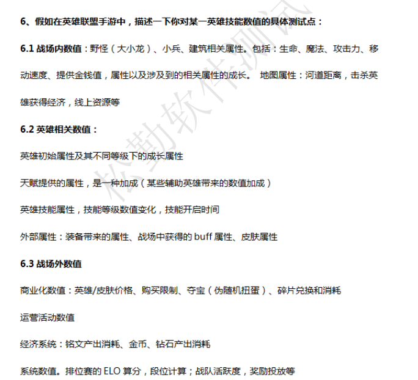

# 游戏测开

游戏测试：软件测试 + 游戏测试

>   普通软件对在线人数的要求就比游戏低
>
>   游戏的操控流畅性要求高
>
>   游戏用户的整体体验度要求高 UI/UE
>
>   游戏对声音和画面要求比较高
>
>   数值、活动、进度、防止外挂、性能、网络


游戏测试：

>   游戏情节的测试：游戏世界中的任务系统的组成，也称为游戏世界的事情驱动
>
>   游戏世界的平衡测试：经济平衡，能力平衡，保证游戏世界的相对竞争公平
>
>   游戏文化的测试：游戏世界的风格，是哪个国家主导


影响游戏质量

>   游戏故事情节、机制、音频和视频、视觉、人机
>
>   登录注册、故事情节、动画、网络模块，数据库模块


测试皮肤

>   **功能测试：**
>
>   **游戏外：**
>
>   皮肤的获取方式、购买（商城）、赠送、合成、游戏各种姿势、是否会有数值的加成（影响哪些数值）
>
>   是否伤害和被伤害的范围变大，模型会变大
>
>   变身前后的被攻击的范围
>
>   **游戏内：**
>
>   备战时是否可以选择皮肤、选择出战的姿态、音效
>
>   释放每个技能是否正常，数值是否会发生变化
>
>   对于会变身或者瞬移的英雄的技能，在释放前后皮肤是否正常，针对不同的体态是否有对应的皮肤
>
>   如果和敌方是同一款皮肤，会变色
>
>   是否技能的攻击距离视觉上变长，是否影响其他其他英雄或者游戏界面的整洁
>
>   
>
>   根据需求文档和策划，编写包含测试目标、测试环境、测试步骤、与预期结果等的规划
>
>   技术类，穿模，颜色，色块等，特效，动作，姿势
>
>   **性能测试：**
>
>   避免使用皮肤时，出现卡顿等体验，表现通常与资源占用率有关，并对美术占用较多资源的问题，进行优化；同一款皮肤
>
>   **打击感测试：**
>
>   皮肤的建模、动画、特效、音效，都影响到皮肤的使用与打击感体验。在不影响平衡性的前提下，尽可能为皮肤做出差异化的特色表现


对王者荣耀的老夫子的大招进行测试的测试点

>   技能释放条件、释放轨迹
>
>   ```xml
>   蓝量、冷却、学习几级
>   ```
>
>   技能效果
>
>   ```xml
>   眩晕、魅惑、直接命中伤害、debuff、buff
>   持续时间
>   是否效果会叠加（被魅惑是否会叠加）
>   ```
>
>   技能伤害
>
>   ```xml
>   技能描述伤害*加成*对方减伤效果
>   ```
>
>   技能组合释放、技能是否可打断（前摇、后摇、优先级）
>
>   技能对象
>
>   ```xml
>   单体、AOE（群体伤害）、锁定类型、指向型
>   ```
>
>   作用范围：是否可以穿墙
>
>   音效、视野（寒冰）
>
>   技能释放是否可移动
>
>   
>
>   技能模板：
>
>   指示器：技能的释放，比如范围，指示的目标
>
>   技能效果：释放前、释放后命中、释放后未命中
>
>   技能伤害值：技能的基础上海、技能每升一级的上海，技能对装备的伤害加成等
>
>   技能冷却cd：初始技能冷却cd，使用后冷却cd，升级后的冷却时间
>
>   技能的伤害类型：单体、AOE（群体伤害）、锁定类型、指向型、buff型、debuff
>
>   技能施法音效：命中音效、飞行音效等、技能印象对游戏体验提升非常大，特别是moba类游戏
>
>   触发特效：特效挂节点、特效效果播放
>
>   武器依赖：某些技能的释放是否依赖某些武器
>
>   施法动作：不同技能的施法动作不同。比如有些是位移、有些是站着的动作（钟馗）
>
>   技能作用阵容：己方、敌方、中立方（野怪）
>
>   技能作用范围：地对地、空对地、地图阻碍墙（是否可以穿墙，闪现）。妲己的二技能无法魅惑飞行状态的鸟人
>
>   技能打断的优先级：优先级相同的相互不可以打断、优先级高的可以打断优先级低的，比如击飞、眩晕、沉默等技能一般能打断一些持续性的技能
>
>   技能前摇阶段是否可打断：技能蓄力型技能，比如花木兰的大
>
>   技能后摇是否可打断：比如上官婉儿的大，后摇就不可以打断，但是前摇在她还没飞起来可以打断
>
>   技能释放过程是否可控：牛头嗜血闪现，霞的大无法选中
>
>   技能释放的过程是否可以释放其他技能：安琪拉放大的过程无法再释放其他技能
>
>   技能是否可移动施法：妲己的大招可以移动施法，但是钟馗，安琪拉的大招不可以移动施法
>
>   被控时、技能可用情况：大多数情况无法使用，但可以使用净化


游戏的分类

>   PRG：角色扮演游戏
>
>   ACT：动作游戏
>
>   AVG: 冒险游戏
>
>   SLG: 策略游戏
>
>   STG：射击类游戏
>
>   PZL：益智类游戏
>
>   CAG：卡片游戏
>
>   MOBA: 多人在线竞技游戏
>
>   单机游戏


网易雷火有哪些游戏

>   倩女幽魂、逆水寒、大话西游、第五人格、荒野行动、战国志、率土之滨、楚留香（一梦江湖）


荒野行动和和平精英的区别

>   画风和武器系统不同
>
>   荒野行动：弹道好控制，时装好看，更具原创性。弥赛亚引擎，细腻，场景逼真还原
>
>   和平精英：玩法和画质表现优先。虚幻4，精良，延续端游


楚留香

>   仙侠类游戏
>
>   捏脸，转视角
>
>   游戏画质，人物，陌生玩家互动，玩具道具，故事情节


洛的技能，如何测试

>   辅助性角色
>
>   被动：
>
>   每40秒（随等级）获得生命值互动，使用普攻和技能命中敌方英雄可减少1秒冷却
>
>   霞和洛可以加入彼此的回城召唤
>
>   主动：
>   一技能：对击中的敌人造成魔法上海，命中敌方英雄或者史诗级野怪后经过3秒，洛将治愈自身及附近友军，接触友方英雄会提早触发治疗特效
>
>   二技能：到友方，赋予护盾，持续3秒，5秒内可重施技能，无需消耗茉莉。目标为霞的时候，护盾效果加倍，冷却时间减半
>
>   三技能：增加50%移速，持续4秒，被触身的敌人将收到魔法伤害，并被魅惑1秒，受此技能影响一次后，会免疫。


打击感

>   打击感”是游戏中通过声音和视觉元素对玩家操作、动作所造成的影响进行表现，进而对玩家感官形成的一种刺激。视觉听觉


lol有什么bug

>   对局加载界面卡在 0% 
>
>   对局结束后不结算或延迟结算 
>
>   结算页面无法点赞 


如何测试一个场景

>   好友系统测试用例
>
>   功能点：
>
>   好友系统界面（游戏好友界面选项卡、黑名单界面选项卡、师徒、关注/粉丝、找朋友、附近的人、亲密关系）
>
>   好友系统功能-系统规则-亲密度增加规则、黑名单加入规则、添加/删除好友规则、添加屏蔽玩家规则、添加玩家人数限制规则


数值的测试点




测概率

>   触发条件，相应数值的测试
>
>   扩大概率（经常使用）：1%的概率不好测，扩大这个概率值，修改代码测试80%, 50%,30%下，期望是否正确，如果正确则1%大概率是正确的
>
>   暴力验证（用得很少）：接口拿出来，自动化，看期望是符合预期


评价手游lol

>   **优点：**
>
>   继承端游的质感、峡谷色彩偏暗、建模的精细度高、动作衔接好
>
>   游戏迭代较快，根据用户进行优化
>
>   把一些中国传统文化与美术设计的融合，退出西游记系列的皮肤
>
>   我喜欢完整的故事线、很有趣、人物之间的关系、不同人物间遇到的语音也不同
>
>   洛和霞、爆爆和拳头姐（蔚）、皮城女警
>
>   情怀
>
>   
>
>   **缺点：**
>
>   有些技能过多
>
>   时间过长，经营
>
>   比较看重团队，不能一人carry
>
>   门槛较高、节奏较慢
>
>   发热严重
>
>   相对端游，英雄不足
>
>   相应赛事没有活动，节假日
>
>   玩家基数比较大导致游戏体验感层次不齐
>
>   举报环境
>
>   可玩性单一
>
>   
>
>   王者荣耀：偏向大众化、全民化、门槛低上手难度小、色彩艳丽、节奏快、技能打击感强


游戏上线前测试

>   -   编写脚本机器人，模拟测试。模拟一个玩家可能进行的操作，操作是随机的，几千个机器人在服务器里面连续执行各种操作，测试各个功能。
>
>   -   真人压力测试，众测平台管理
>   -   测试兼容性：兼容的客户端
>   -   RAM、ROM、CPU：影响客户端性能，造成游戏不流畅，卡顿，崩溃，闪退
>   -   分辨率：画质、UI、特效、动画
>   -   网游：浏览器、客户端、操作系统


怪物数目不对应？

>   怪物ID不正确
>
>   怪物模型一致，怪物id不一致
>
>   计数器问题，数据库存储问题


游戏经历

>   我的世界：玩了2个月，当时和朋友设计了我们喜欢的房子，并搭建了起来，超级超级有成就感，而且一起搭建的过程就很有趣。
>   哈利波特：玩了半年，常规卡牌都有，有一部分稀有的橙卡，战绩达到顶尖决斗者就打不上去啦，很喜欢里面的特效和故事细节。
>   王者荣耀：断断续续玩过半年吧，等级为星耀。创新、公平、丰富、交友
>   lol：玩了小半年，等级钻石。
>   和平精英：很久之前玩过，印象里是铂金。练一练可以1v3嘿嘿嘿
>   楚留香：玩过3个月，人物很好看！
>   荒野乱斗：断断续续玩了2年，几乎全英雄，满级。短时间的休闲游戏
>   三国杀：本科研究生一直在玩，常规英雄都有，战绩一般，比较考验对英雄的克制关系。
>   walkr：玩了一年。收集类游戏，有大半部分的星球。很有成就感！
>   橙光小游戏：断断续续偶尔会玩，一般会喜欢探索不同的结局。
>   qq飞车：本科一直在断断续续玩，打到钻石，当时喜欢参加车队赛。音乐好听，朋友
>
>   还玩过一些主机游戏，比如双人成行，真的很有趣，讲策略讲配合讲操作，趣味性也很高。
>
>   
>
>   喜欢的游戏类型：卡牌，收集类，MOBA
>   不喜欢的游戏：打怪升级...


